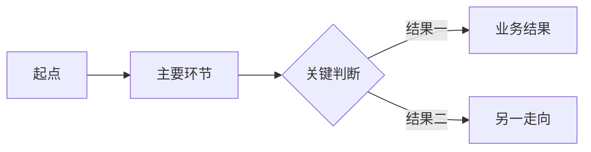

# 项目文档关联规则

本文件用于判断何时建议创建项目文档，并规定用户明确要求创建后，项目文档与 `ctx-*` 上下文单元的组织、关联和维护方式。

## 目录

- 两种知识视图
- 先检查职责边界
- 安全压缩测试
- 文档建议的强信号
- 创建授权
- 文档边界
- 默认结构
- 主视觉与写作规则
- 路径与命名
- 双向关联
- 内容分工
- 关联维护
- 完成检查

## 两种知识视图

`ctx-*` 与项目文档面向不同读者，可以使用不同粒度：

- **上下文视图**：按稳定职责边界拆分，保存修改代码时必须获取的精确事实、约束、高价值入口和证据，服务 AI 的准确触发和按需加载。
- **文档视图**：按业务主题、用户流程或问题域组织，默认用一个以图为优先的主视觉和少量补充信息展示业务走向，服务用户快速阅读和理解。

项目文档是业务地图，不是完整规格、修改手册或代码索引。AI 在执行精确修改前，仍应读取相关 `ctx-*` 和必要代码，不得只根据项目文档推导实现约束。

一个项目文档可以关联多个职责清晰的 `ctx-*`。每个 `ctx-*` 最多声明一份主文档，避免同一业务走向分散在多处。其他项目文档可以把该上下文单元作为普通参考，但不会因此建立需要联动维护的主文档关系。

没有主文档的上下文单元继续使用独立承载形态。项目基础上下文不要求创建主文档。

## 先检查职责边界

复杂知识可能表现为两种情况：

- **横向复杂**：混入多个可独立命名的职责。此时先按 `taxonomy.md` 拆分上下文单元。
- **纵向复杂**：知识仍属于单一职责，但内部存在难以压缩的流程、状态或规则关系。此时继续执行安全压缩测试。

文档可以为了连续阅读覆盖多个上下文单元，但每个章节必须能说明它对应哪些 `ctx-*`，不能反向模糊上下文单元的职责边界。

## 安全压缩测试

先尝试按 `template.md` 将知识压缩为以下内容：

- 一段职责说明。
- 一组高价值入口与对象。
- 若干可以独立理解的事实与约束。
- 一个简短的核心流程。
- 必要的防护约束和证据来源。

然后分别判断：

- 精确修改所需的信息是否已能由职责清晰的 `ctx-*` 安全承载。
- 人类读者是否仍需要跨职责边界的业务地图，才能快速理解起点、主路径、关键分支和结果。

处理方式：

- 如果知识可以在 `ctx-*` 中安全压缩，且不存在独立的业务地图阅读需求，不建议项目文档。
- 如果精确修改知识必须分散在多个职责单元，而用户需要跨边界理解同一业务走向，记录项目文档建议，但不自动创建文件。
- 如果知识只是代码入口、技术防护、证据或历史原因，即使内容较多，也继续由 `ctx-*` 承载，不据此建议项目文档。

不得使用代码行数、文件数量、规则条数或任意评分代替安全压缩测试。

## 文档建议的强信号

以下内容是建议项目文档的强信号：

- 存在多阶段流程、生命周期或状态转换。
- 多条规则之间存在优先级、覆盖、互斥或组合关系。
- 需要决策表才能准确表达输入与结果。
- 同时存在正常、异常、降级、回滚或补偿流程。
- 流程跨多个页面、模块、接口或参与方。
- 需要流程图、时序图或状态图才能准确表达关系。
- 多个上下文单元共同组成一个适合用户连续阅读的业务主题或用户流程。

出现强信号后仍要执行安全压缩测试。简单流程或少量独立规则，不因主题名称重要就建议创建文档。

## 创建授权

只有用户明确要求创建项目文档时，才能创建新文件。以下表达可以视为明确授权：

- “为这个上下文创建文档”。
- “把这些复杂规则整理成项目文档”。
- “初始化上下文时，同时生成用户可读文档”。
- “把这些 ctx 组织成一份业务全景文档”。

用户只要求初始化、记录、维护或更新持久化上下文，不包含创建项目文档的授权。安全压缩测试不通过时：

- 正常完成能够安全写入的上下文维护。
- 在报告中列出建议文档的主题、原因、建议路径和相关 `ctx-*`。
- 不创建目录或文档，也不因为等待用户决定而阻断其他维护。

用户明确要求创建时，仍须满足以下条件：

- 至少关联一个职责明确的 `ctx-*`。
- 证据足以形成稳定说明。
- 不与已有主文档重复。
- 不包含敏感信息或未经确认的猜测。
- 用户没有要求只分析、只规划或不要写文件。

普通项目文档写作不属于本机制。无法关联到任何 `ctx-*` 的文档，由用户另行决定处理方式。

## 文档边界

先从用户的阅读目的确定文档主题，再选择相关上下文单元：

- 业务主题，例如订阅生命周期、广告导出、账号权限。
- 用户流程，例如注册到付费、上传到识别、筛选到导出。
- 问题域，例如缓存一致性、国际化路由、错误降级。

不得直接按 `ctx-*` 分类机械拼接文档。一个文档可以关联多个分类的上下文单元，但各部分必须共同服务同一个用户可理解的主题。

如果一份文档出现多个互不依赖的阅读目的，拆为多份文档。如果多个 `ctx-*` 只是共享关键词，没有共同的用户阅读主题，不合并到同一文档。

## 默认结构

关联项目文档默认使用以下轻量结构。只保留对当前业务主题有信息的可选章节，不保留空标题。模板中的 `flowchart` 只是普通业务步骤的示例；实际生成时必须按「主视觉与写作规则」选择形式，不固定使用 `flowchart`。

````md
# <业务主题>

用一个简短段落说明参与者、触发条件、业务目标、最终结果和阅读边界。

## 业务全景



## 关键规则

| 条件 | 业务结果 | 后续走向 |
| --- | --- | --- |
| 只记录会改变流程方向或用户结果的条件 | 结果 | 下一环节 |

## 业务边界

只说明容易被误解的范围、不会发生的行为，或不属于本文档的内容。

<details>
<summary>维护信息</summary>

## 持久化上下文

本文档由 `project-context` 持久化上下文机制维护。

- [上下文单元名称](../../.agents/skills/ctx-<category>-<topic>/SKILL.md)：对应“业务全景”或具体补充章节。

</details>
````

「业务全景」和末尾的「持久化上下文」是必需内容。「关键规则」只在存在改变业务走向或结果的条件时出现；「业务边界」只在存在容易自然误解的范围时出现。

## 主视觉与写作规则

每份文档默认只使用一个主视觉，并优先用图建立业务全貌。先识别当前主题最重要的关系，再选择表达形式：

- 普通业务步骤和条件分支使用 Mermaid `flowchart`。
- 以状态及状态转换为主的生命周期使用 Mermaid `stateDiagram-v2`。
- 多个参与方之间的先后交互使用 Mermaid `sequenceDiagram`。
- 不同参与方分别负责不同阶段时，使用带分区的流程图。
- 业务对象及其关系比处理顺序更重要时，使用关系图。
- 过程只是极短的线性链路时，使用简单箭头链，不为形式完整强行生成 Mermaid。
- 主体是多个条件组合与结果的对应关系时，使用决策表；只在图能帮助理解决策顺序时，再补充简化决策图。

写作时遵守：

- 一级标题之后先给出业务边界和主视觉，不先展示维护元数据、背景或术语表。
- 主视觉使用用户、产品或业务语言，不把文件路径、函数名、组件名、接口字段或其他实现细节作为主要内容。
- 主视觉只展示影响人类理解业务的关系。技术重试、内部错误处理和不改变用户或业务结果的局部分支不进入主视觉。
- 正文不复述主视觉已经表达的关系。表格和列表只补充其中不适合表达的条件、结果或边界。
- 背景、术语、示例、设计原因和异常分支默认不生成。只有缺少某项会导致主视觉被自然误解时，才补充直接消除误解所需的最少内容。
- 主视觉应无需反复缩放、左右拖动或在大量交叉线中寻找主路径。不满足时，依次删除技术节点、合并无分支的连续步骤、将次要异常移入 `ctx-*`；仍无法快速扫读时，按业务主题拆分文档。

## 路径与命名

本机制创建的项目文档统一放在：

```text
docs/project-context/
```

文件名按文档面向用户的主题命名，使用小写英文和连字符：

```text
docs/project-context/<文档主题>.md
```

例如：

```text
docs/project-context/subscription-lifecycle.md
docs/project-context/export-workflow.md
docs/project-context/cache-consistency.md
```

文件名不使用 `ctx-` 前缀，也不使用 architecture、modules、policies 等分类名机械拼接。`docs/project-context/` 已表明文档由本机制创建和维护，文件名只表达用户阅读主题。

不要为单个文档增加额外子目录。文档数量或主题层级确实需要分组时，先按 `reorganization.md` 输出目录调整计划并等待用户确认。

创建前检查目标路径是否被版本控制忽略。路径被忽略时，不自动改用其他目录；列入待确认项，由用户决定是否调整项目忽略规则。

固定目录中已经存在同名文件时：

- 文件已经声明相关 `ctx-*` 且主题一致：复用并关联维护。
- 文件没有固定关联章节、主题不一致或存在规则冲突：不覆盖，列入待确认项。

项目其他位置已经存在同主题文档时，将其作为证据或相关资料。是否迁移到 `docs/project-context/` 并由本机制接管，属于结构调整。

## 双向关联

每个关联的 `ctx-*` 必须包含：

```md
## 关联项目文档

- 主文档：[订阅生命周期](../../../docs/project-context/subscription-lifecycle.md#业务全景)
- 文档职责：展示从选择套餐到订阅结束的业务走向。
- 加载要求：需要跨职责理解订阅生命周期时，先读取对应章节。
```

项目文档在正文末尾的折叠「维护信息」中包含：

```md
<details>
<summary>维护信息</summary>

## 持久化上下文

本文档由 `project-context` 持久化上下文机制维护。

- [订阅权益](../../.agents/skills/ctx-policies-subscription-entitlements/SKILL.md)：对应“业务全景”和“关键规则”章节。
- [订阅状态契约](../../.agents/skills/ctx-contracts-subscription-status/SKILL.md)：对应“业务全景”章节。

</details>
```

文档列出全部关联上下文单元，并说明每个单元对应的章节。`ctx-*` 的主文档链接尽量指向具体章节锚点。

每个 `ctx-*` 最多声明一份主文档。一份项目文档可以关联多个 `ctx-*`，但不能重复列出同一个上下文单元，也不能吸收与文档主题无关的上下文。

## 内容分工

项目文档负责：

- 用一个以图为优先、与当前主题关系匹配的主视觉展示业务全貌。
- 补充必要的状态、决策关系、参与方或跨模块边界。
- 为不同职责的 `ctx-*` 提供面向用户的连续阅读入口。

`ctx-*` 上下文单元负责：

- 触发条件、负责范围和不负责范围。
- 主文档路径、对应章节和加载要求。
- 后续任务定位所需的高价值入口、字段语义和精确约束。
- 技术流程、异常处理、防护约束和防止错误修改所需的设计原因。
- 证据来源、待确认事项和相关上下文单元。

`ctx-*` 可以保留执行精确修改所必需的流程约束，但不大段复制项目文档已经表达的业务走向。项目文档不复制各个 `ctx-*` 的代码入口、精确约束、技术异常、设计历史和全部证据清单。

## 关联维护

文档创建并建立关联后，维护任一端时检查全部关联端：

1. 从文档读取全部关联 `ctx-*`，或从 `ctx-*` 定位主文档。
2. 核对本次变化影响的文档章节和上下文单元。
3. 只修改受影响的内容，不为制造同步记录而机械改动其他文件。
4. 检查职责边界、章节锚点、业务走向、精确约束和证据是否一致。
5. 分别报告每个文件“已更新”或“已检查，无需修改”。

以下变化通常需要联动更新：

- 文档主题、章节边界或上下文职责发生变化。
- 文档或上下文单元移动、重命名、拆分或合并。
- 文档变化使 skill 的触发条件、加载要求、章节锚点或已确认事实失效。
- skill 中新增的稳定知识改变了主文档展示的业务路径、关键规则或业务结果。

取消关联、删除文档、更换主文档或调整 `docs/project-context/` 目录结构属于结构调整，必须按 `reorganization.md` 先输出计划并等待确认。

## 完成检查

创建或维护关联项目文档后，确认：

- 文档位于 `docs/project-context/`，文件名准确表达用户阅读主题。
- 文档列出全部关联 `ctx-*`，每个链接都存在且职责匹配。
- 每个关联 `ctx-*` 反向指向该文档及具体章节。
- 每个 `ctx-*` 最多存在一份主文档。
- 文档围绕一个用户可理解的主题，没有机械复刻 skill 分类。
- 一级标题后先给出边界说明和一个以图为优先、与业务关系匹配的主视觉。
- 主视觉无需反复缩放、左右拖动或在大量交叉线中寻找主路径，且没有混入不改变用户或业务结果的实现细节。
- 正文只补充改变走向的条件、业务结果和必要边界，没有复述主视觉。
- 实现入口、精确约束、技术异常、设计历史和证据清单没有膨胀项目文档。
- 业务走向和精确修改知识没有在文档和 `ctx-*` 中大段重复维护。
- 报告说明每个关联文件分别进行了什么处理。
